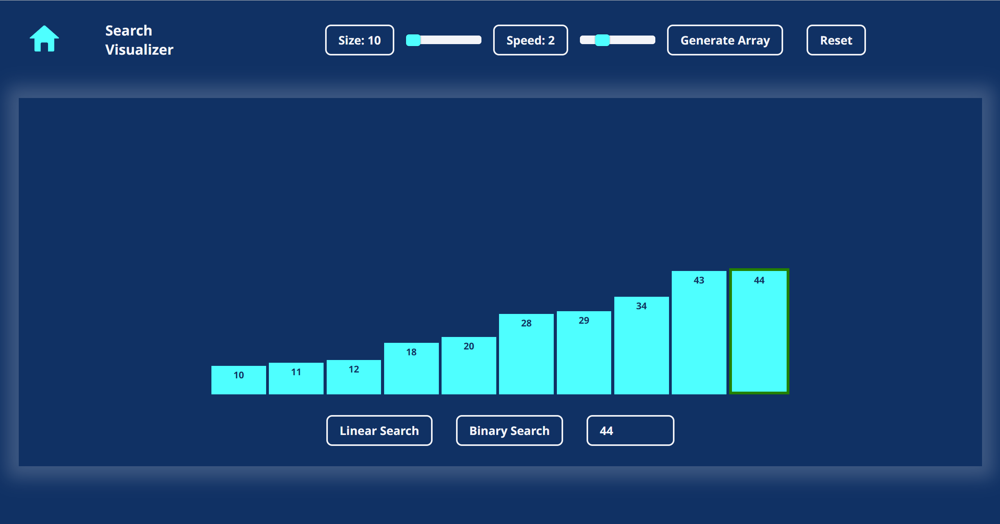

# Algorithm Visualizer

A JavaScript-based web application designed to help users visualize different algorithms in action, including sorting, searching, and shortest-path. This tool provides an interactive interface for understanding how algorithms work step-by-step.




## Features

- **Sorting Algorithms:** Visualize sorting algorithms like Bubble Sort, Selection Sort, Insertion Sort, Merge Sort, and Quick Sort with interactive bars that change dynamically.
- **Searching Algorithms:** Explore searching algorithms such as Linear Search and Binary Search, with visual cues showing the steps.
- **Shortest-Path Algorithms:** Visualization: Visualize shortest-path algorithms like Dijkstra’s and Bellman-Ford on a dynamically generated grid.
- **Dynamic Grid and Array Generation:** Users can control the size and speed of visualizations using sliders and buttons.
- **Responsive Design:** The application is fully responsive, providing an optimal viewing experience across all devices.

## Installation

### Prerequisites

Ensure you have Python 3.x installed on your system. You can download it from [python.org](https://www.python.org/).

### Required Python Packages

This project requires the following Python packages:
- `Django`

You can install Django using `pip`:

```bash
pip install django
```

### Setting Up the Project

1. Clone this repository to your local machine:

   ```bash
   git clone https://github.com/ry-schwartz/algorithm_visualizer.git
   cd algorithm_visualizer
   ```
2. Ensure all dependencies are installed (as mentioned above).

3. Run database migrations:

    ```bash
   python manage.py migrate
   ```

4. Collect static files:

    ```bash
   python manage.py collectstatic
   ```

5. Set up any environment variables required for the project.

### Usage

To run the application locally, navigate to the project directory and execute the following command:

   ```bash
   python manage.py runserver
   ```

1. Open your web browser and go to `http://127.0.0.1:8000/`.
2. Choose an algorithm type from the home page (Search, Sort, or Shortest-Path).
3. Use the provided controls (sliders, dropdowns, buttons) to adjust the settings and visualize the algorithm in action.

### Deployment on Heroku

This project is configured to be deployed on Heroku. Follow these steps:

1. Ensure you have the Heroku CLI installed.

2. Log in to your Heroku account:

    ```bash
   heroku login
   ```

3. Create a new Heroku application:

    ```bash
   heroku create algorithm_visualizer
   ```

4. Set up the environment variables required for the project:

    ```bash
   heroku config:set SECRET_KEY='your-secret-key'
   heroku config:set DEBUG=0
   ```

5. Push the code to Heroku:

    ```bash
   git push heroku main
   ```

6. Run the database migrations on Heroku:

    ```bash
   heroku run python manage.py migrate
   ```

7. Open the application in your web browser:

    ```bash
   heroku open
   ```

### Troubleshooting

- Ensure JavaScript is enabled in your browser, as the visualizations rely heavily on it.
- On Heroku, make sure that all environment variables are correctly set.

### Contributing

Contributions are welcome! Please fork the repository and submit a pull request if you wish to improve the application or fix bugs.